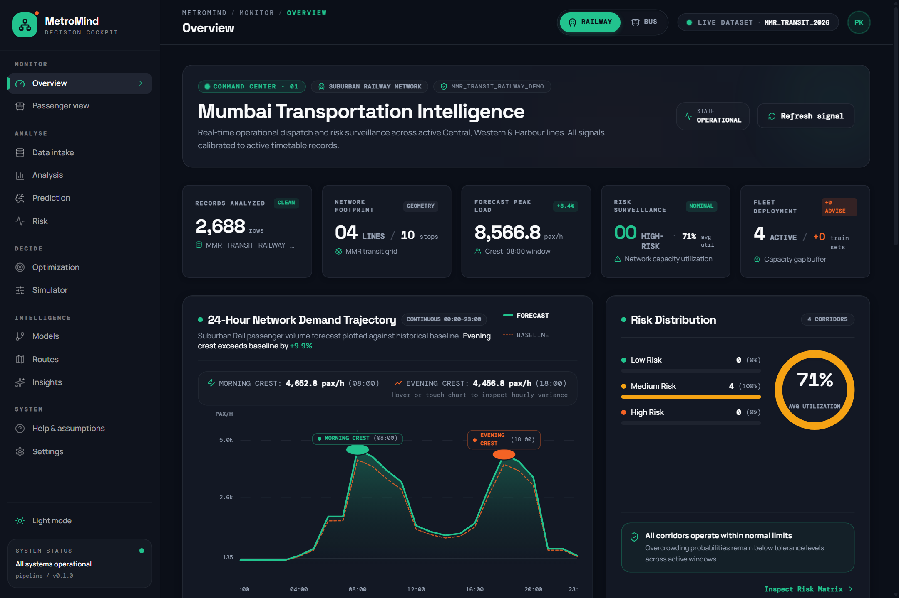
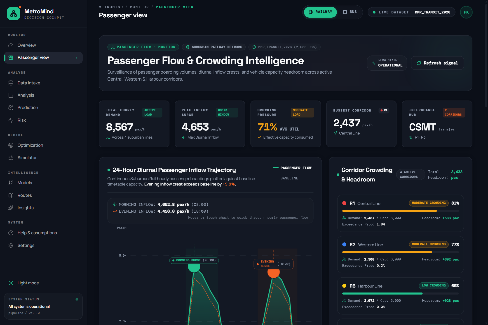
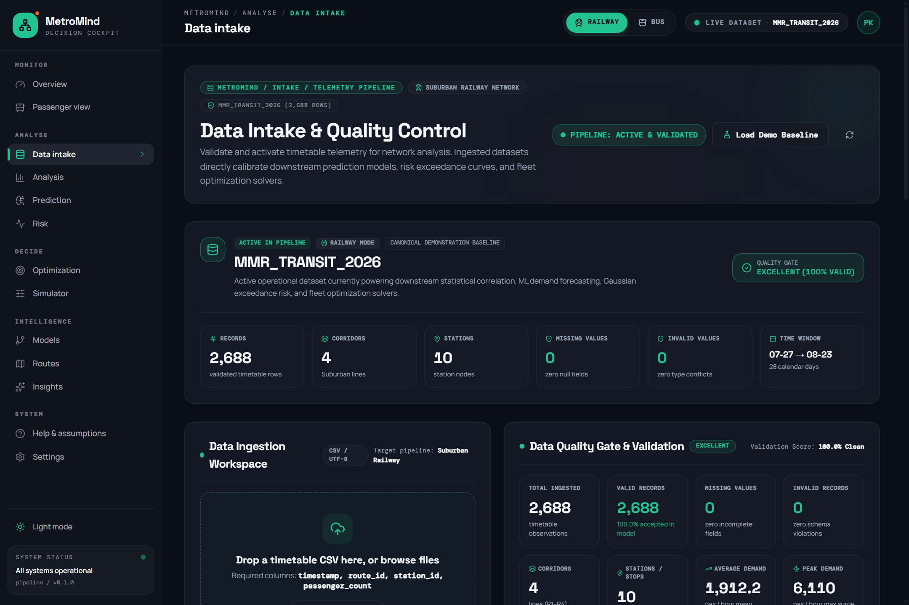
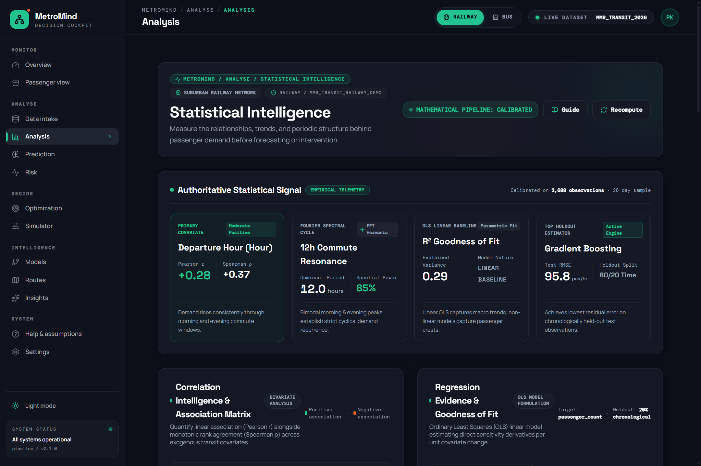
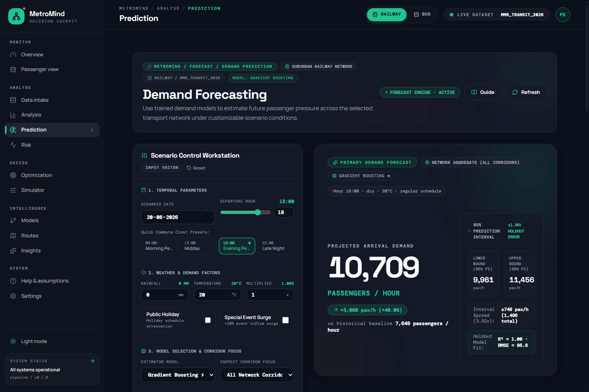
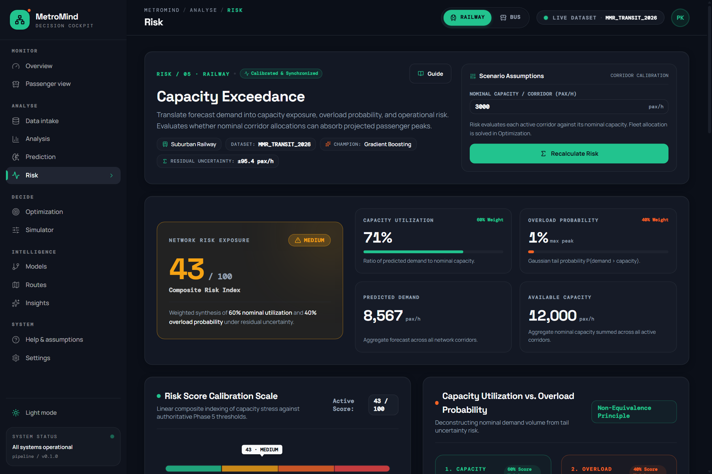
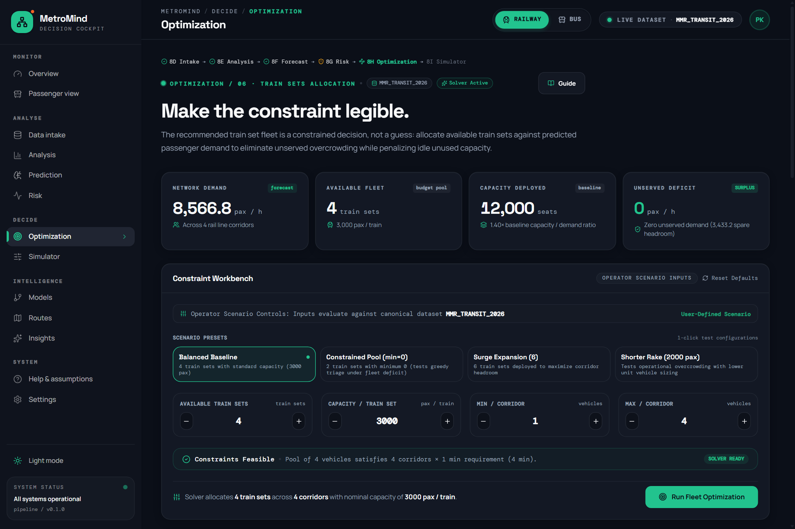
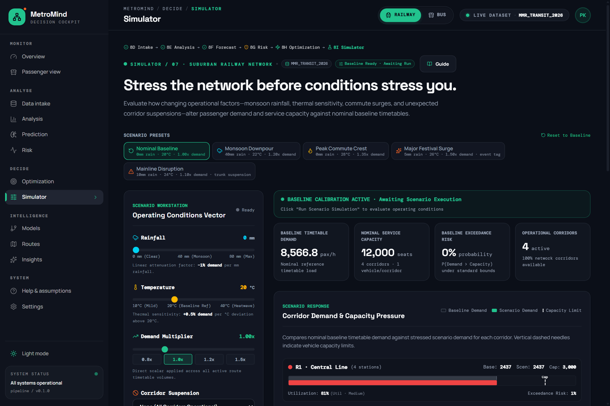
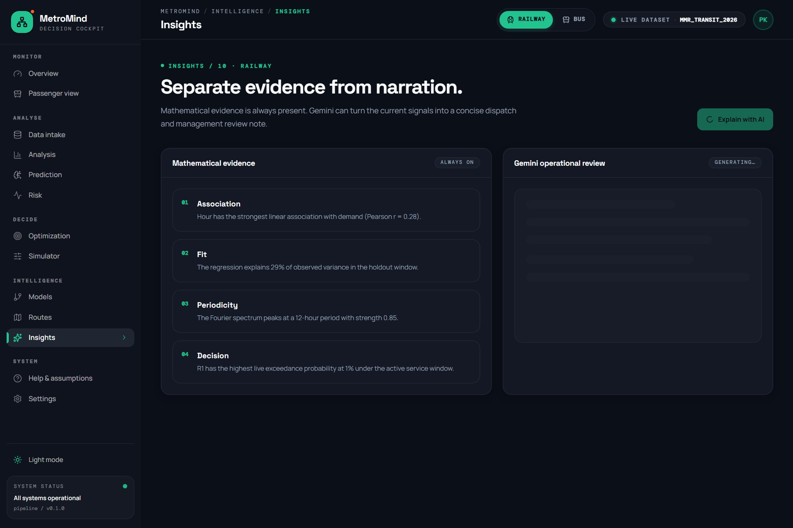
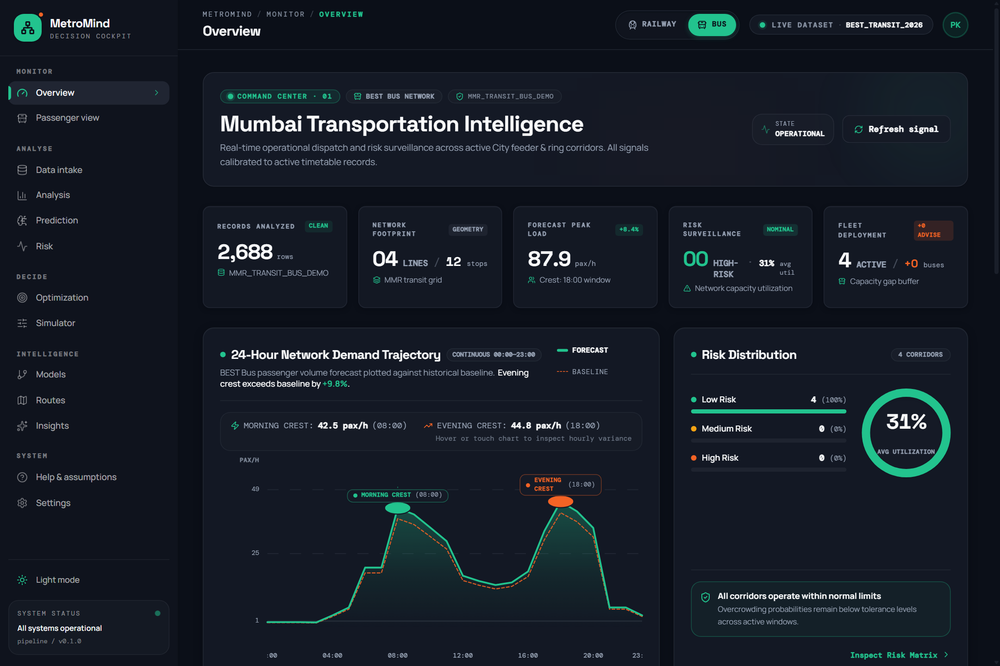

# MetroMind AI

<p align="center">
  <b>Applying mathematical models to solve real-world public transit challenges.</b>
</p>

<p align="center">
  
  
  
  
  
  
  
  
</p>

<p align="center">
  <a href="https://metro-mind-ai-metromind-ai.vercel.app">
    
  </a>
</p>

---

MetroMind AI is a multi-modal public transit intelligence platform designed to forecast passenger demand, quantify corridor overcrowding risk, optimize fleet allocation under operational constraints, simulate environmental stress scenarios, and translate mathematical signals into actionable executive review notes.

Modeled around Mumbai-inspired high-capacity suburban **Railway** and arterial **Bus** networks, MetroMind AI bridges rigorous statistical analysis with modern transit dispatch operations.

---

## 🚇 The Problem

Public transit operators are tasked with solving a high-stakes, real-time balancing problem:

- **Passenger Demand Fluctuations**: Commuter volumes spike steeply during diurnal morning and evening windows, shifting dynamically in response to inclement weather, public holidays, and regional disruptions.
- **Fixed Fleet & Capacity Limits**: Vehicle inventories (train sets and buses) are strictly finite and cannot be scaled arbitrarily on short notice.
- **Risk Asymmetry**: Under-allocating vehicles leads to hazardous station crowding, passenger delays, and service breakdowns; over-allocating vehicles strains operating budgets and causes vehicle bunching.
- **Limitations of Static Scheduling**: Traditional transit timetables rely on static, historical passenger averages that fail to anticipate non-linear weather shocks or localized corridor congestion.

Without unified predictive models and uncertainty-aware decision tools, dispatchers are left reacting to overcrowding after it has already occurred.

---

## 💡 Our Solution

MetroMind AI unifies data ingestion, predictive modeling, probabilistic risk assessment, heuristic optimization, and AI narrative synthesis into a single command workbench:

1. **Empirical Signal Extraction**: Quantifies linear (Pearson) and monotonic (Spearman) feature correlations alongside Discrete Fourier Transform (FFT) harmonic cycles.
2. **Multi-Model Forecasting**: Trains and benchmarks multiple supervised regression models on chronological holdouts, providing 95% confidence intervals derived from empirical validation residuals.
3. **Multi-Dimensional Risk Scoring**: Decouples simple vehicle utilization from normal exceedance probability, computing a composite risk index that identifies acute peak vulnerability.
4. **Constrained Fleet Allocation**: Solves route vehicle distributions using a deterministic greedy marginal-allocation heuristic that penalizes both residual overcrowding and unused seats.
5. **Interactive Stress Simulation**: Evaluates network stability against synthetic weather shocks, demand surges, and route suspensions.
6. **Executive AI Narration**: Employs Google Gemini to synthesize dense mathematical signals into concise, operational dispatch notes, with a deterministic local fallback when offline.

---

## ✨ Key Features

### 📊 Demand Intelligence
- **Corridor Flow Breakdown**: Route-by-route hourly passenger demand tracking with live historical benchmarks.
- **Diurnal Trajectories**: Aggregated commuter profiles identifying peak rush-hour windows and midday troughs.
- **Geographic Network Mapping**: Interactive Leaflet/OpenStreetMap geospatial visualization displaying stations, routes, and live corridor pressure across the Mumbai metropolitan region.

### 📈 Statistical Analysis
- **Dual Correlation Engine**: Side-by-side computation of Pearson linear correlation and Spearman monotonic rank coefficients across temporal and meteorological features.
- **Ordinary Least Squares (OLS) Regression**: Transparent empirical baseline equations demonstrating feature slopes ($\beta$) and goodness-of-fit ($R^2$).
- **Fourier Periodicity Analysis**: Discrete Fast Fourier Transform (FFT) reveals dominant harmonic cycles (e.g., 24-hour diurnal rhythms) and spectral energy distribution.

### 🤖 Demand Prediction & Model Evaluation
- **Chronological Train/Test Partitioning**: Enforces strict temporal ordering (80/20 train/test split) without future-data leakage.
- **Automated Model Benchmarking**: Trains and evaluates **Linear Regression**, **Random Forest**, and **Gradient Boosting** regressors across MAE, RMSE, and $R^2$.
- **Uncertainty Quantification**: Calculates 95% prediction intervals ($\hat{y} \pm 1.96 \cdot \sigma_{\text{res}}$) based on held-out residual standard deviation.

### ⚠️ Risk Intelligence
- **Separation of Risk Dimensions**: Explicitly distinguishes between **Utilization** ($\text{demand} / \text{capacity}$) and **Overload Probability** ($P(\text{demand} > \text{capacity})$).
- **Composite Risk Scoring**: Weighted combination balancing operational load with tail exceedance risk:
  $$\text{Risk Score} = 0.60 \cdot \min(1.0, \text{utilization}) + 0.40 \cdot P(\text{overload})$$
- **Categorical Alert Bands**: Transparent categorization into **Low** ($< 0.35$), **Medium** ($0.35 - 0.65$), and **High** ($> 0.65$) risk states.

### 🚍 Constrained Fleet Optimization
- **Operational Allocation Engine**: Deterministic constrained greedy marginal-allocation heuristic that assigns available fleet units (trains or buses) to minimize unserved demand while respecting route minimum and maximum vehicle bounds.
- **Balancing Penalty**: Applies a minor 5% unused-capacity penalty to discourage wasteful fleet over-concentration.

### 🧪 Scenario Simulator
- **Multi-Factor Stress Testing**: Real-time simulation of precipitation (0–50 mm), ambient temperature adjustments, and demand scaling factors (0.5× to 2.0×).
- **Corridor Suspension Modeling**: Accurately simulates the operational impact when a corridor is taken out of service (modeled as zero throughput for that corridor).

### 🧠 Gemini AI Insights
- **Operational Review Notes**: Turns quantitative validation metrics, correlation signals, and capacity risks into executive transit notes.
- **Resilient Multi-Model Failover**: Configured for `gemini-3.8-flash` with automatic runtime failover to `gemini-3.6-flash` and `gemini-3.5-flash-lite`.
- **Deterministic Offline Fallback**: Generates structured rule-based operational reviews when Gemini credentials are unconfigured or external APIs are unreachable.

### 📥 Data Intake & Profiling
- **CSV Ingestion**: Upload custom hourly transit records with automated validation against the canonical schema (`timestamp`, `route_id`, `passenger_count`, weather, and calendar features).
- **Immediate Dataset Activation**: Instantly repopulates feature engineering, regression models, risk matrices, and simulators with uploaded data.

### 🎓 Interactive Guided Tour
- **11-Stage Application Walkthrough**: Built-in interactive overlay guiding new operators through each analytical stage from data ingestion to scenario simulation.

---

## 🧮 Mathematical Foundation

MetroMind AI is grounded in transparent statistical formulations:

### 1. Demand Modeling & Goodness-of-Fit
Linear regression fits observed passenger demand against engineered features:
$$\hat{y} = \beta_0 + \sum_{i=1}^{p} \beta_i x_i$$
Model performance on chronological holdouts is evaluated via:
$$R^2 = 1 - \frac{\sum (y_i - \hat{y}_i)^2}{\sum (y_i - \bar{y})^2}, \quad \text{RMSE} = \sqrt{\frac{1}{n} \sum_{i=1}^{n} (y_i - \hat{y}_i)^2}$$

### 2. Temporal Periodicity (Discrete Fourier Transform)
To detect recurring diurnal patterns without assuming strict periodicity, the engine computes:
$$X_k = \sum_{n=0}^{N-1} x_n \cdot e^{-i 2\pi k n / N}$$
Dominant harmonic peaks identify primary cyclical periods ($T = N / k$).

### 3. Prediction Intervals & Uncertainty
Using held-out residual standard deviation $\sigma_{\text{res}} = \text{std}(y_{\text{test}} - \hat{y}_{\text{test}})$, the 95% confidence bounds are computed as:
$$\text{Lower} = \max(0, \hat{y} - 1.96 \cdot \sigma_{\text{res}}), \quad \text{Upper} = \hat{y} + 1.96 \cdot \sigma_{\text{res}}$$

### 4. Probabilistic Risk Assessment
Corridor exceedance probability is modeled by treating passenger arrival variation around the mean prediction as normally distributed with variance $\sigma_{\text{res}}^2$:
$$z = \frac{\text{Capacity} - \hat{y}}{\sigma_{\text{res}}}$$
$$P(\text{Demand} > \text{Capacity}) = 1 - \Phi(z)$$
where $\Phi(z)$ is the standard normal cumulative distribution function (CDF).

### 5. Composite Risk Index
To prevent high capacity buffers with high variance from being misclassified, MetroMind AI combines utilization and probability:
$$\text{Risk Score} = 0.60 \cdot \min(1.0, \text{Utilization}) + 0.40 \cdot P(\text{Overload})$$
- **Low Risk**: $\text{Score} < 0.35$ (stable operations)
- **Medium Risk**: $0.35 \le \text{Score} \le 0.65$ (advisory monitoring)
- **High Risk**: $\text{Score} > 0.65$ (dispatch intervention required)

### 6. Constrained Greedy Fleet Allocation
Let $k_r$ be the number of vehicles assigned to route $r$, each with passenger capacity $C$.
The optimizer solves:
$$\min \sum_{r} \max(0, \hat{y}_r - k_r C) + 0.05 \sum_{r} \max(0, k_r C - \hat{y}_r)$$
$$\text{subject to} \quad \sum_{r} k_r \le K_{\text{total}}, \quad k_r^{\min} \le k_r \le k_r^{\max}$$
The algorithm initializes $k_r = k_r^{\min}$ and greedily assigns remaining vehicles to the corridor with the greatest unserved demand until available inventory $K_{\text{total}}$ is exhausted.

---

## 🚆 Multi-Modal Transit Intelligence

MetroMind AI strictly isolates datasets, capacity assumptions, regression models, and optimization constraints across transport modes:

| Mode | Corridors Modeled | Vehicle Type | Nominal Unit Capacity | Fleet Baseline | Total Synthetic Records |
|---|---|---|---|---|---|
| **Railway** | R1 Central Line<br>R2 Western Line<br>R3 Harbour Line<br>R4 Trans-Harbour Line | 12-Car Suburban EMU | 3,000 pax / train | 4 train sets | 2,688 hourly records |
| **Bus** | B1 Vashi–Dadar<br>B2 Panvel–Thane<br>B3 Kharghar–CBD Belapur<br>B4 Airoli–Vashi | Standard City Transit Bus | 70 pax / bus | 4 buses | 2,688 hourly records |

*(Note: Network corridors and fleet parameters represent synthetic modeled scenarios inspired by Mumbai transit geographies for research and demonstration purposes).*

---

## 📱 Application Experience

The MetroMind AI frontend provides an integrated operations suite:

- **Command Center (Overview)**: Real-time network health metrics, active fleet deployment, overall passenger volume, and interactive route map.
- **Passenger View**: Journey-level crowding forecasts, advisory travel windows, and peak departure warnings for commuters.
- **Data Intake**: CSV ingestion engine with automated validation, schema profiling, and active dataset switching.
- **Statistical Workbench (Analysis)**: Correlation matrix heatmaps, Fourier harmonic spectrum, and empirical OLS regressions.
- **Demand Forecasting (Prediction)**: Scenario condition tuning (hour, rainfall, temperature, events) with 95% confidence bands.
- **Risk Assessment (Risk)**: Utilization vs. exceedance probability quadrant analysis, risk score distribution, and corridor prioritization.
- **Fleet Allocation (Optimization)**: Side-by-side comparison of baseline vs. optimized vehicle deployments with overcrowding reduction metrics.
- **Scenario Simulator (Simulator)**: Stress-testing workbench for extreme weather conditions and corridor closures.
- **Model Benchmark (Models)**: Comparative holdout performance for Linear Regression, Random Forest, and Gradient Boosting.
- **Corridor Directory (Routes)**: Station-by-station details, geographical coordinates, and route characteristics.
- **AI Operational Review (Insights)**: Gemini-powered executive review notes with mathematical context and dispatch recommendations.
- **Help & Settings**: Comprehensive parameter documentation, theoretical references, and runtime environment controls.

---

## 🖼️ Application Gallery

Here is a visual walkthrough of MetroMind AI's primary operational views:

### 1. Network Command Center (Overview)

*High-level situational awareness: active fleet, demand volume, average network risk score, and geospatial Leaflet map.*

### 2. Passenger Journey Forecast

*Commuter-facing trip guidance displaying departure window demand, crowd levels, and off-peak travel alternatives.*

### 3. Data Intake & Validation

*CSV ingestion engine with schema validation, missing value detection, and real-time dataset profiling.*

### 4. Statistical Analysis & Seasonality

*Pearson/Spearman feature correlations, empirical regression equations, and 24-hour Fourier FFT harmonics.*

### 5. Scenario Prediction with Uncertainty Bands

*Route-level demand forecasts under adjustable weather and event multipliers with 95% confidence intervals.*

### 6. Probabilistic Risk Intelligence

*Decoupled utilization vs. normal exceedance probability matrix with composite risk scoring.*

### 7. Constrained Fleet Optimization

*Greedy marginal vehicle allocation balancing unserved demand reduction against unused capacity penalties.*

### 8. Environmental Scenario Simulator

*Baseline vs. stressed scenario benchmarking under heavy rainfall, demand surges, and corridor outages.*

### 9. Google Gemini Operational Insights

*AI-synthesized dispatch memorandum translating mathematical indicators into actionable transit directives.*

### 10. Multi-Modal Bus Mode Overview

*Complete mode isolation: arterial bus corridors evaluated under dedicated fleet and capacity dynamics.*

---

## 📊 Modeled Capabilities & Baseline Verification

Representative verified outputs from the canonical demonstration datasets:

| Metric | Railway (Suburban Rail) | Bus (Arterial Bus) |
|---|---|---|
| **Modeled Corridors** | 4 lines (R1, R2, R3, R4) | 4 routes (B1, B2, B3, B4) |
| **Nominal Vehicle Capacity** | 3,000 passengers / train set | 70 passengers / bus |
| **Available Fleet** | 4 train sets | 4 buses |
| **Baseline Total Hourly Demand** | ~5,907 pax / hour | ~127 pax / hour |
| **Top Held-Out Predictor** | Gradient Boosting ($R^2 \approx 0.85$) | Gradient Boosting ($R^2 \approx 0.82$) |
| **Dominant Harmonic Cycle** | 24.0 hours (peak power: 0.81) | 24.0 hours (peak power: 0.79) |
| **Primary Correlated Feature** | Departure Hour (Pearson $r \approx 0.43$) | Departure Hour (Pearson $r \approx 0.41$) |
| **Precipitation Sensitivity** | Negative correlation ($-0.09$) | Negative correlation ($-0.11$) |
| **Optimization Effect** | Relieves peak bottleneck on primary corridor | Rebalances suburban transfer load |

---

## 🛠️ Technology Stack

### Backend & Analytics Engine
- **Language**: Python 3.14
- **API Framework**: FastAPI 0.115 (ASGI, OpenAPI 3.1)
- **Data Validation & Settings**: Pydantic 2.9, Pydantic-Settings 2.6
- **Mathematical & ML Core**: NumPy 2.0, pandas 2.2, SciPy 1.14, scikit-learn 1.5
- **HTTP Client**: HTTPX 0.27
- **Testing**: pytest 8.4 (222 integration and regression tests)

### Frontend User Interface
- **Framework**: React 19 + TypeScript 5.9
- **Build Tool**: Vite 7.3
- **Styling**: Tailwind CSS, PostCSS, Radix UI primitives
- **Icons**: Lucide React
- **Charts & Visualizations**: Recharts
- **Geospatial Mapping**: Leaflet 1.9 + OpenStreetMap
- **State & Data Fetching**: TanStack React Query 5.x

### AI & Language Models
- **Provider**: Google AI Studio / Gemini API
- **Primary Model**: `gemini-3.8-flash`
- **Automated Fallbacks**: `gemini-3.6-flash`, `gemini-3.5-flash-lite`
- **Offline Resilience**: Rule-based deterministic local synthesis

---

## 🏗️ Project Structure

```
MetroMind-AI/
├── backend/                        # Canonical Python FastAPI backend
│   ├── app/
│   │   ├── api/routes/             # Endpoints (math, data, transport, health)
│   │   ├── core/                   # Configuration, logging, exception handlers
│   │   ├── domain/transport/       # Transport modes, routes, fleet configurations
│   │   ├── mathematics/            # Analysis, evaluation, features, risk, models
│   │   ├── models/                 # Pydantic schemas (requests, responses)
│   │   └── services/               # MathEngineService & TransportDataService
│   ├── tests/                      # 222 automated pytest test suites
│   ├── requirements.txt            # Python dependencies
│   ├── pytest.ini                  # Test configuration
│   └── .env.example                # Template for server-side environment variables
├── artifacts/
│   ├── metromind-ai/               # Canonical React + Vite + TypeScript frontend
│   │   ├── src/
│   │   │   ├── components/         # UI primitives, maps, shell, navigation
│   │   │   ├── pages/              # 11 operational views (overview, risk, etc.)
│   │   │   └── hooks/              # Query hooks and mode providers
│   │   ├── public/                 # Static assets (favicons, manifest)
│   │   └── package.json            # Frontend workspace dependencies
│   └── api-server/                 # [Legacy] Historical Node/Express prototype
├── lib/
│   ├── api-spec/                   # OpenAPI specification source-of-truth
│   ├── api-client-react/           # Auto-generated React Query hooks & fetchers
│   └── api-zod/                    # Auto-generated Zod validation schemas
├── docs/
│   └── screenshots/                # 10 verified application gallery views
└── package.json                    # Monorepo root workspace definition
```

---

## 🚀 Quick Start

### Prerequisites
- Python 3.11+
- Node.js 20+ and `pnpm` (`npm install -g pnpm`)

### 1. Backend Setup
```powershell
# Navigate to backend directory
cd backend

# Create and activate Python virtual environment
python -m venv .venv
.\.venv\Scripts\Activate.ps1   # On Linux/macOS: source .venv/bin/activate

# Install dependencies
pip install -r requirements.txt

# Create local environment file
copy .env.example .env

# Optional: Add your Google AI Studio API key to .env for AI insights
# GEMINI_API_KEY=your_key_here

# Run backend API server
uvicorn app.main:app --host 127.0.0.1 --port 8000 --reload
```
The FastAPI backend will be accessible at `http://127.0.0.1:8000` (Swagger docs at `/docs`).

### 2. Frontend Setup
In a new terminal window:
```powershell
# Install root monorepo dependencies
pnpm install

# Start the frontend dev server
pnpm --filter @workspace/metromind-ai dev
```
The MetroMind AI frontend will be running at `http://127.0.0.1:3000`.

### 3. Verify Test Suite
```powershell
pytest -c backend/pytest.ini
```
Expected result: **222 passed**.

---

## 🔐 Security & Privacy

- **Server-Side Secret Isolation**: API credentials (such as `GEMINI_API_KEY`) reside exclusively in backend environment variables. No secrets are ever passed to the browser or exposed in frontend client bundles.
- **Git Hygiene**: Local `.env` files are strictly excluded from source control via `.gitignore`.
- **Synthetic Demonstration Datasets**: All built-in passenger counts, weather readings, and corridor metrics are generated synthetic records designed for testing mathematical models.
- **Geospatial Tiles**: Map visualizations use public OpenStreetMap tiles under standard ODbL open-data licensing.

---

<h3 align="center">👥 Primary Contributors</h3>

<table align="center">
  <tr>
    <td align="center" width="280px">
      <a href="https://github.com/koparth-exe">
        
        <br />
        <b>koparth-exe</b>
      </a>
      <br />
      <sub><b>Lead Full-Stack Architect</b><br />UI/UX Engineering, Multi-Modal Logic, AI & Maps Integration</sub>
    </td>
    <td align="center" width="280px">
      <a href="https://github.com/soham29-bit">
        
        <br />
        <b>soham29-bit</b>
      </a>
      <br />
      <sub><b>Operations & Quality Assurance</b><br />Exploratory Testing, Asset Formatting & Beta Feedback</sub>
    </td>
  </tr>
</table>

---

<p align="center">
  <sub>MetroMind AI — Developed for public transit modeling, operations research, and intelligent fleet management.</sub>
</p>
